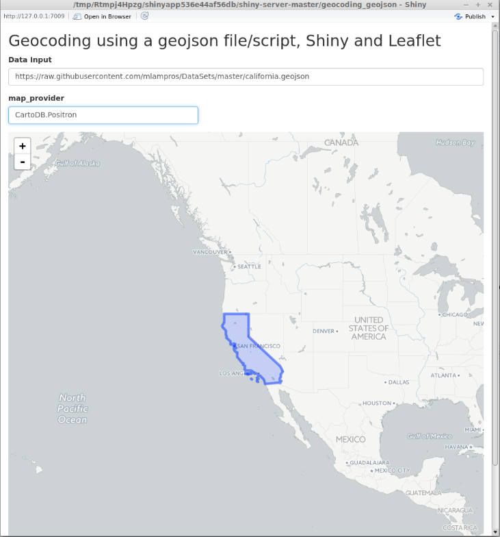
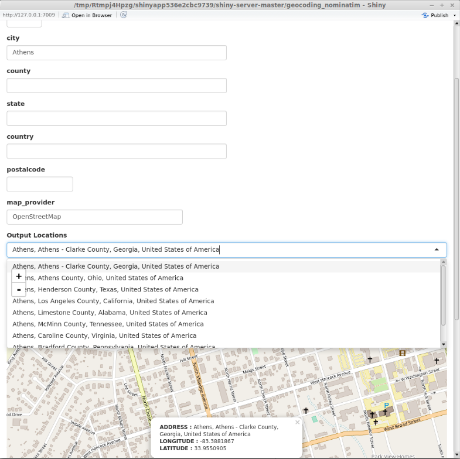
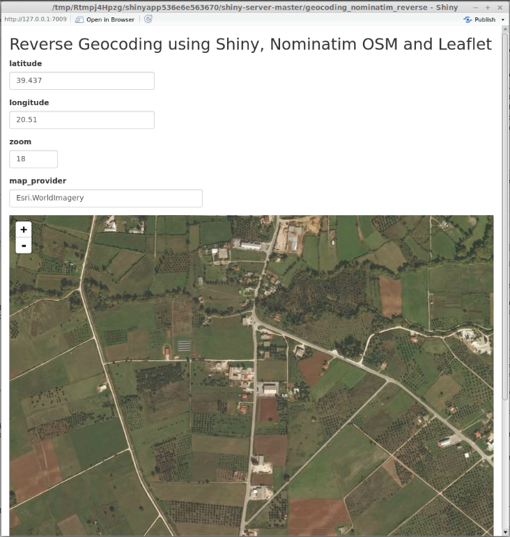

"[GeoJSON](https://en.wikipedia.org/wiki/GeoJSON) is an open standard format designed for representing simple geographical features, along with their non-spatial attributes, based on JavaScript Object Notation. The features include points (therefore *addresses* and *locations*), line strings (therefore *streets*, *highways* and *boundaries*), polygons (*countries*, *provinces*, *tracts of land*), and multi-part collections of these types. GeoJSON features need not represent entities of the physical world only; *mobile routing* and *navigation apps*, for example, might describe their service coverage using GeoJSON. The GeoJSON format differs from other GIS standards in that it was written and is maintained not by a formal standards organization, but by an Internet working group of developers." <br>

**geojsonR** relies mainly on [RFC 7946](https://tools.ietf.org/pdf/rfc7946.pdf), which is the new standard specification of the GeoJSON format. Moreover, the package takes advantage of a C++11 JSON library ([json11](https://github.com/dropbox/json11)) to do the encoding *from* and *to* geojson data objects and all functions are exported in R using the *Rcpp* and *RcppArmadillo* packages. <br>


The following lines show an [example GeoJson object](https://tools.ietf.org/pdf/rfc7946.pdf#page=5) (*"feature_collection.geojson"*),

```{r, eval = F}

{
    "type": "FeatureCollection",
    "features": [{
      
        "type": "Feature",
         "geometry": {
             "type": "Point",
             "coordinates": 
                [102.0, 0.5]
         },
         "properties": {
         "prop0": "value0"
         }
        }, {
        
           "type": "Feature",
           "geometry": {
               "type": "LineString",
               "coordinates": [
                 [102.0, 0.0],
                 [103.0, 1.0],
                 [104.0, 0.0],
                 [102.0, 0.0]
                 ]
               },
               "properties": {
                "prop0": "value0",
                "prop1": 0.0
               }
        }
    ]
}

```
<br>
The purpose of this package was not only the implementation of functions to convert from and to geojson objects, but also the development of web applications based on geojson objects / data, which I'll explain later in the Vignette. 

<br>

##### **FROM_GeoJson**

<br>

The **FROM_GeoJson** function can take as input a *path to a file*, *a valid url* (beginning from http..) or a *GeoJson object in form of a character string*. The output is a named list and the resulted *coordinates* member is a matrix, as the following code chunks illustrate,
<br>

```{r, eval = F}

# assuming that the data is saved in the previously mentioned "feature_collection.geojson"

library(geojsonR)

# INPUT IS A PATH TO A FILE

file_js = FROM_GeoJson(url_file_string = "feature_collection.geojson")

file_js

```

```{r, eval = F}

# output :


$features
$features[[1]]
$features[[1]]$geometry
$features[[1]]$geometry$type
[1] "Point"

$features[[1]]$geometry$coordinates
     [,1] [,2]
[1,]  102  0.5


$features[[1]]$properties
$features[[1]]$properties$prop0
[1] "value0"


$features[[1]]$type
[1] "Feature"


$features[[2]]
$features[[2]]$geometry
$features[[2]]$geometry$type
[1] "LineString"

$features[[2]]$geometry$coordinates
     [,1] [,2]
[1,]  102    0
[2,]  103    1
[3,]  104    0
[4,]  102    0


$features[[2]]$properties
$features[[2]]$properties$prop0
[1] "value0"

$features[[2]]$properties$prop1
[1] 0


$features[[2]]$type
[1] "Feature"


$type
[1] "FeatureCollection"

```
<br>


```{r, eval = F}

# INPUT IS A GeoJson OBJECT (character string)

str_js = '{ "type": "MultiPolygon", 
            "coordinates": [
                [[[102.0, 2.0], [103.0, 2.0], [103.0, 3.0], [102.0, 3.0], [102.0, 2.0]]],
                [[[100.0, 0.0], [101.0, 0.0], [101.0, 1.0], [100.0, 1.0], [100.0, 0.0]],
                 [[100.2, 0.2], [100.8, 0.2], [100.8, 0.8], [100.2, 0.8], [100.2, 0.2]]]
                ]
}'


char_js = FROM_GeoJson(url_file_string = str_js)

char_js

```

```{r, eval = F}

$type
[1] "MultiPolygon"

$coordinates
$coordinates[[1]]
     [,1] [,2]
[1,]  102    2
[2,]  103    2
[3,]  103    3
[4,]  102    3
[5,]  102    2

$coordinates[[2]]
$coordinates[[2]][[1]]
     [,1] [,2]
[1,]  100    0
[2,]  101    0
[3,]  101    1
[4,]  100    1
[5,]  100    0

$coordinates[[2]][[2]]
      [,1] [,2]
[1,] 100.2  0.2
[2,] 100.8  0.2
[3,] 100.8  0.8
[4,] 100.2  0.8
[5,] 100.2  0.2

```
<br>


```{r, eval = F}

# INPUT IS A URL (beginning from http..)

url_path = "https://raw.githubusercontent.com/mlampros/DataSets/master/california.geojson"

url_js = FROM_GeoJson(url_file_string = url_path)

str(url_js)

Warning message:
closing unused connection 3 (https://raw.githubusercontent.com/mlampros/DataSets/master/california.geojson) 

```

```{r, eval = F}

List of 4
 $ geometry  :List of 2
  ..$ type       : chr "MultiPolygon"
  ..$ coordinates:List of 11
  .. ..$ : num [1:56, 1:2] -120 -120 -120 -120 -120 ...
  .. ..$ : num [1:64, 1:2] -120 -120 -120 -120 -120 ...
  .. ..$ : num [1:36, 1:2] -120 -120 -120 -120 -120 ...
  .. ..$ : num [1:24, 1:2] -120 -120 -120 -120 -119 ...
  .. ..$ : num [1:16, 1:2] -119 -119 -119 -119 -119 ...
  .. ..$ : num [1:42, 1:2] -119 -119 -119 -119 -119 ...
  .. ..$ : num [1:48, 1:2] -119 -118 -118 -118 -118 ...
  .. ..$ : num [1:11, 1:2] -122 -122 -122 -122 -122 ...
  .. ..$ : num [1:11, 1:2] -123 -123 -123 -123 -123 ...
  .. ..$ : num [1:9, 1:2] -122 -122 -122 -122 -122 ...
  .. ..$ : num [1:1154, 1:2] -124 -124 -124 -124 -124 ...
 $ id        : chr "california"
 $ properties:List of 11
  ..$ abbreviation: chr "CA"
  ..$ area        : num 423968
  ..$ capital     : chr "Sacramento"
  ..$ city        : chr "Los Angeles"
  ..$ group       : chr "US States"
  ..$ houseseats  : num 53
  ..$ landarea    : num 403466
  ..$ name        : chr "California"
  ..$ population  : num 38332521
  ..$ statehood   : chr "1850-09-09"
  ..$ waterarea   : num 20502
 $ type      : chr "Feature"

```
<br><br>

##### **TO_GeoJson**

<br>

The **TO_GeoJson** function is an [R6 class](https://cran.r-project.org/package=R6), which takes as input a *vector* (in case of a *Point*) or a *list* (in case of the rest geometry objects) and converts it to a GeoJson object (named list). The output can also include the data in form of a geojson character string if the argument *stringify* is TRUE. The following code chunk shows the output for a polygon with interior rings,


```{r, eval = F}

init = TO_GeoJson$new()

polygon_WITH_dat = list(list(c(100, 1.01), c(200, 2.01), c(100, 1.0), c(100, 1.01)),

                        list(c(50, 0.5), c(50, 0.8), c(50, 0.9), c(50, 0.5)))

polygon_with = init$Polygon(polygon_WITH_dat, stringify = TRUE)

str(polygon_with)

```

```{r, eval = F}

List of 3
 $ json_dump  : chr "{\"coordinates\": [[[100, 1.01], [200, 2.0099999999999998], [100, 1], [100, 1.01]], [[50, 0.5], [50, 0.80000000000000004], [50,"| __truncated__
 $ type       : chr "Polygon"
 $ coordinates:List of 2
  ..$ :List of 4
  .. ..$ : num [1:2] 100 1.01
  .. ..$ : num [1:2] 200 2.01
  .. ..$ : num [1:2] 100 1
  .. ..$ : num [1:2] 100 1.01
  ..$ :List of 4
  .. ..$ : num [1:2] 50 0.5
  .. ..$ : num [1:2] 50 0.8
  .. ..$ : num [1:2] 50 0.9
  .. ..$ : num [1:2] 50 0.5

```

```{r, eval = F}

# if "stringify = TRUE"

cat(polygon_with$json_dump)

{"coordinates": [[[100, 1.01], [200, 2.0099999999999998], [100, 1], [100, 1.01]], [[50, 0.5], [50, 0.80000000000000004], [50, 0.90000000000000002], [50, 0.5]]], "type": "Polygon"}

```
<br>

The package documentation includes examples on how to build geojson objects for all geometries ( Point, MultiPoint, LineString, MultiLineString, Polygon (with or without interior rings), MultiPolygon, GeometryCollection, Feature and FeatureCollection ).

<br><br>

##### **Dump_From_GeoJson**

<br>

The **Dump_From_GeoJson** function returns a GeoJson character string (GeoJson-dump) for a file or url. The following code excerpt shows the output for the previously mentioned *feature_collection.geojson* file,

<br>

```{r, eval = F}

dump_js = Dump_From_GeoJson(url_file = "feature_collection.geojson")

cat(dump_js)

```

```{r, eval = F}

{"features": [{"geometry": {"coordinates": [102, 0.5], "type": "Point"}, "properties": {"prop0": "value0"}, "type": "Feature"}, {"geometry": {"coordinates": [[102, 0], [103, 1], [104, 0], [105, 1]], "type": "LineString"}, "properties": {"prop0": "value0", "prop1": 0}, "type": "Feature"}], "type": "FeatureCollection"}

```


<br>

The same applies to url files beginning from *http..*.


<br><br>

##### **Features_2Collection**

<br>

The aim of the **Features_2Collection** function is to take a vector of valid path's / url's of *Feature object* files as input and to return a *Feature Collection*. For instance, if I have the following two files ("Feature1.geojson", "Feature2.geojson"),

<br>

```{r, eval = F}

# "Feature1.geojson"

{
 "type": "Feature",
 
 "id": 1,
 
 "bbox": [-10.0, -10.0, 10.0, 10.0],
 
 "geometry": {
 
    "type": "Polygon",
    
    "coordinates": [
    
         [
            [-10.0, -10.0], [10.0, -10.0], [10.0, 10.0], [-10.0, -10.0]
         ]
      ]
    },

    "properties": {
  
      "prop_1": "addr1",
  
      "prop_2": 1
    }
}

```
<br>

```{r, eval = F}

# "Feature2.geojson"

{
 "type": "Feature",
 
 "id": 2,
 
 "bbox": [-10.0, -10.0, 10.0, 10.0],
 
 "geometry": {
 
    "type": "Polygon",
    
    "coordinates": [
    
         [
            [-10.0, -10.0], [10.0, -10.0], [10.0, 10.0], [-10.0, -10.0]
         ]
      ]
    },

    "properties": {
  
      "prop_1": "addr2",
  
      "prop_2": 2
    }
}

```

<br>

then the output of the function will be a Feature Collection dump,

<br>

```{r, eval = F}

vec_in = c("Feature1.geojson", "Feature2.geojson")

res_fcol = Features_2Collection(vec_in, bbox_vec = NULL)

cat(res_fcol)

```

```{r, eval = F}

{"bbox": [], "features": [{"bbox": [-10, -10, 10, 10], "geometry": {"coordinates": [[[-10, -10], [10, -10], [10, 10], [-10, -10]]], "type": "Polygon"}, "id": 1, "properties": {"prop_1": "addr1", "prop_2": 1}, "type": "Feature"}, {"bbox": [-10, -10, 10, 10], "geometry": {"coordinates": [[[-10, -10], [10, -10], [10, 10], [-10, -10]]], "type": "Polygon"}, "id": 2, "properties": {"prop_1": "addr2", "prop_2": 2}, "type": "Feature"}], "type": "FeatureCollection"}

```


<br><br>

##### **Web applications using shiny, leaflet, geojsonR and nominatim**

<br>

A secondary thought about the *geojsonR* package was to make some of its functions available for applications. I've built some simple [geocoding](https://en.wikipedia.org/wiki/Geocoding) applications taking advantage of shiny, leaflet and Nominatim. The source code of those applications can be found in my [Github repository](https://github.com/mlampros/shiny-server). To open the applications one should either use *from inside an R session*,

* shiny::runGitHub('shiny-server', 'mlampros', subdir = 'geocoding_geojson')
* shiny::runGitHub('shiny-server', 'mlampros', subdir = 'geocoding_nominatim')
* shiny::runGitHub('shiny-server', 'mlampros', subdir = 'geocoding_nominatim_reverse')

or follow the web-links using the [shinyapps.io](http://www.shinyapps.io/) service,

* https://lampros.shinyapps.io/shiny_geocoding/
* https://lampros.shinyapps.io/shiny_geojson/
* https://lampros.shinyapps.io/shiny_reverse_geocoding/

The latter service is limited to 25 active hours per month (for free accounts), thus if the limit is exceeded then the applications won't be available to the end users.

I won't go into detail about [shiny](https://shiny.rstudio.com/) and [leaflet](https://rstudio.github.io/leaflet/), because both packages are well documented and users can find information on how to include them in their projects. On the other hand, "*Nominatim* is a tool to search OpenStreetMap (OSM) data by name and address and to generate synthetic addresses of OSM points (reverse geocoding). It can be found at *nominatim.openstreetmap.org*. Nominatim is also used as one of the sources for the search box on the OpenStreetMap home page. Several companies provide hosted instances of Nominatim that you can query via an API." More information on how to use *Nominatim* can be found at http://wiki.openstreetmap.org/wiki/Nominatim).

<br>

##### **geocoding_geojson**

<br>

The first application *geocoding_geojson* takes a valid *GeoJson* file, url (beginning from http..) or a valid json character string as input (*Data Input field*) and a *map_provider* (defaults to OpenStreetMap) and returns a leaflet map. If the *map_provider* is other than OpenStreetMap, then the input parameter should match one of the names(leaflet::providers). More information about the leaflet:providers can be found in the following links: https://rstudio.github.io/leaflet/basemaps.html, https://github.com/leaflet-extras/leaflet-providers and http://leaflet-extras.github.io/leaflet-providers/preview/index.html. The following image shows the output for the [california.geojson](https://raw.githubusercontent.com/mlampros/DataSets/master/california.geojson) file using the *CartoDB.Positron* as *map_provider*,

<br>




<br><br>

##### **geocoding_nominatim**

<br>

The second application *geocoding_nominatim* takes a valid address (using either a streetname, a housenumber, a city, a county, a state, a country, a postalcode and/or a map_provider) and returns all possible locations. The user then can choose one of the resulted locations from the *Output Locations* drop-down menu (if there are more than one) and the output will be a leaflet map with information about the address, longitude and latitude. This type of geocoding is called *forward geocoding* (or *address geocoding*) and is the process of finding an associated latitude and longitude for a given address. The next image shows the results in case that the input to the city field is *Athens*,

<br>



<br> 

The user can be more specific about the location taking advantage of all or more than one fields. In case that there is no match, the following warning will be returned : *"the nominatim query returns an empty array. Please, modify the initial query"*.


<br><br>

##### **geocoding_nominatim_reverse**

<br>

The last application *geocoding_nominatim_reverse* takes a valid latitude, longitude, zoom (ranges from 0 to 18) and/or a map_provider and returns an address for these coordinates. A leaflet map will be created with information about the associated address or the nearest address point (*Reverse geocoding*). The following image shows my current location (approximately) using the *Esri.WorldImagery* as *map_provider*,

<br>



<br>

To report any bugs / issues for the shiny-geocoding applications use the following link [https://github.com/mlampros/shiny-server/issues](https://github.com/mlampros/shiny-server/issues).

<br>

An updated version of **geojsonR** can be found in my [Github repository](https://github.com/mlampros/geojsonR) and to report bugs/issues for the package use the following link, [https://github.com/mlampros/geojsonR/issues](https://github.com/mlampros/geojsonR/issues).

<br>
